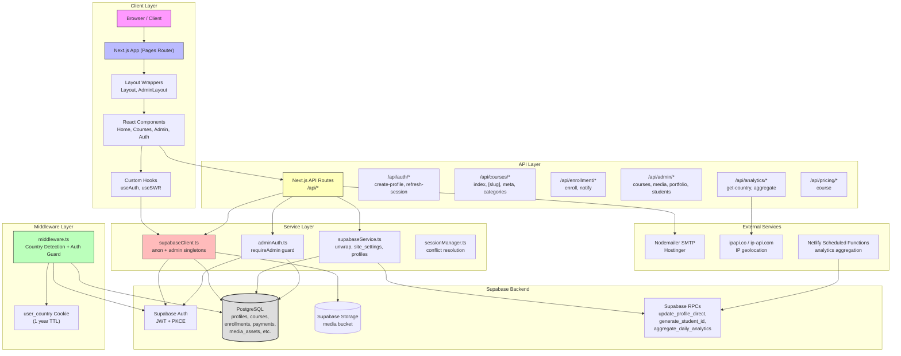

# ITWala Academy — Project Memory

## 1. Project Summary

ITWala Academy is a full-stack educational platform that combines a web development company, AI Academy, and edutech training provider. The platform enables course discovery, enrollment, progress tracking, and administrative management. It serves three primary user roles — **admin**, **instructor**, and **student** — with role-based access enforced at both the middleware and component levels.

The platform is deployed on **Netlify** and uses **Supabase** as its backend-as-a-service (PostgreSQL database, authentication, and file storage). It features country-aware pricing (INR, USD, GBP, EUR), automated student ID generation, enrollment email notifications, analytics tracking, and a comprehensive media library.

---

## 2. Technical Stack Overview

| Layer | Technology | Version / Notes |
|---|---|---|
| **Framework** | Next.js | v16.1.6 (Pages Router) |
| **Language** | TypeScript | v5.8.3 |
| **UI Library** | React | v18.2.0 |
| **Styling** | TailwindCSS | v3.4.17 + custom design system |
| **Auth** | Supabase Auth Helpers | PKCE flow, JWT-based |
| **Database** | Supabase / PostgreSQL | Row-Level Security (RLS) |
| **File Storage** | Supabase Storage | Signed upload URLs |
| **Forms** | React Hook Form | v7.46.1 |
| **Animations** | Framer Motion | v10.18.0 |
| **Icons** | Lucide React + Heroicons | v0.542.0 / v2.0.18 |
| **Notifications** | React Hot Toast | v2.5.2 |
| **Email** | Nodemailer | SMTP via Hostinger |
| **PDF Generation** | jsPDF + jsPDF-AutoTable | v4.0.0 / v5.0.2 |
| **Video** | React Player | v2.13.0 |
| **Carousel** | React Slick + Slick Carousel | v0.29.0 / v1.8.1 |
| **Utilities** | clsx, class-variance-authority, tailwind-merge | Component class composition |
| **Deployment** | Netlify | Scheduled functions for analytics |
| **Linting** | ESLint + Next.js config | v8.49.0 |
| **Testing** | Jest + ts-jest | v30.3.0 |

---

## 3. Architecture Diagram



---

## 4. Knowledge Graph — Module Relationships & Data Flow

```mermaid
graph LR
    subgraph "Authentication & Authorization"
        MW["middleware.ts"]
        useAuth["useAuth hook"]
        AdminAuth["adminAuth.ts"]
        SessionMgr["sessionManager.ts"]
        SupabaseClient["supabaseClient.ts"]
    end

    subgraph "Public Pages"
        Home["index.tsx"]
        CoursesPage["courses/index.tsx"]
        CourseDetail["courses/[slug].tsx"]
        AuthPage["auth/index.tsx"]
        About["about.tsx"]
        Contact["contact.tsx"]
    end

    subgraph "Protected Pages"
        Dashboard["dashboard/index.tsx"]
        AdminPages["admin/*"]
        AdminDash["admin/index.tsx"]
        AdminCourses["admin/courses/*"]
        AdminMedia["admin/media/*"]
        AdminSettings["admin/settings/*"]
        AdminStudents["admin/students/*"]
        AdminRevenue["admin/revenue/*"]
        AdminInvoices["admin/invoices/*"]
        AdminPortfolio["admin/portfolio/*"]
    end

    subgraph "API Routes"
        CoursesAPI["/api/courses"]
        EnrollmentAPI["/api/enrollment/enroll"]
        AdminMediaAPI["/api/admin/media/*"]
        AdminCoursesAPI["/api/admin/courses/*"]
        AnalyticsAPI["/api/analytics/*"]
        PricingAPI["/api/pricing/*"]
    end

    subgraph "Services & Utils"
        SupabaseService["supabaseService.ts"]
        SiteSettings["siteSettings.ts"]
        Analytics["analytics.ts"]
        Currency["currency.ts"]
        CountryDetection["countryDetection.ts"]
        PDFGen["pdfGenerator.ts"]
        CertGen["certificateGenerator.ts"]
    end

    subgraph "Database Tables"
        Profiles[("profiles")]
        Courses[("courses")]
        Categories[("categories")]
        Enrollments[("enrollments")]
        Payments[("payments")]
        Invoices[("invoices")]
        MediaAssets[("media_assets")]
        SiteSettingsTable[("site_settings")]
        PageViews[("page_views")]
        AnalyticsEvents[("analytics_events")]
        AnalyticsData[("analytics_data")]
        PortfolioSettings[("portfolio_settings")]
        Webinars[("webinars")]
    end

    subgraph "External"
        SMTP["Nodemailer SMTP"]
        SupabaseStorage["Supabase Storage<br/>media bucket")]
        IPGeo["IP Geolocation APIs"]
    end

    MW --> useAuth
    MW --> SupabaseClient
    useAuth --> SupabaseClient
    AdminAuth --> SupabaseClient
    SessionMgr --> SupabaseClient

    Home --> CoursesPage
    Home --> CourseDetail
    AuthPage --> EnrollmentAPI
    CourseDetail --> EnrollmentAPI

    Dashboard --> useAuth
    AdminPages --> AdminAuth
    AdminDash --> SupabaseClient
    AdminCourses --> AdminCoursesAPI
    AdminMedia --> AdminMediaAPI
    AdminSettings --> SiteSettings

    CoursesAPI --> SupabaseService
    EnrollmentAPI --> SupabaseClient
    EnrollmentAPI --> SMTP
    AdminMediaAPI --> SupabaseClient
    AdminMediaAPI --> SupabaseStorage
    AdminCoursesAPI --> SupabaseClient
    AnalyticsAPI --> IPGeo

    SupabaseService --> Profiles
    SupabaseService --> Courses
    SupabaseService --> SiteSettingsTable
    SupabaseService --> PageViews
    SupabaseService --> AnalyticsEvents
    SupabaseService --> AnalyticsData

    SiteSettings --> SiteSettingsTable
    Analytics --> PageViews
    Analytics --> AnalyticsEvents
    Currency --> PricingAPI
    CountryDetection --> PricingAPI

    CertGen --> PDFGen
    CertGen --> Enrollments

    AdminMediaAPI --> MediaAssets
    AdminMediaAPI --> SupabaseStorage

    EnrollmentAPI --> Enrollments
    EnrollmentAPI --> Profiles

    style Profiles fill:#e1f5fe
    style Courses fill:#e1f5fe
    style Enrollments fill:#e1f5fe
    style SupabaseClient fill:#fff3e0
    style SupabaseService fill:#fff3e0
```

---

## 5. Core Design Patterns & Implementation Conventions

### 5.1 Authentication & Authorization Pattern

- **Middleware-first guard**: `middleware.ts` intercepts every request, detects country via Cloudflare `cf-ipcountry` header, sets `user_country` cookie (1-year TTL), and enforces role-based route protection.
- **Dual admin detection**: Admin status is determined by three signals — `user_metadata.role === 'admin'`, `profiles.role === 'admin'`, or email === `admin@itwala.com`.
- **Profile auto-creation**: When a user signs up and no profile exists, middleware and `useAuth` hook auto-upsert a profile row with appropriate role assignment.
- **Session conflict resolution**: `sessionManager.ts` detects and clears stale auth tokens from `localStorage` to prevent Supabase session conflicts.

### 5.2 Service Layer Pattern

- All Supabase data access is centralized in `src/services/supabaseService.ts`.
- Error handling uses a custom `ServiceError` class wrapping Postgrest errors.
- `unwrap()` and `unwrapOrNull()` helpers provide consistent error propagation.
- Raw Supabase clients are re-exported only for cases that genuinely need them.

### 5.3 Component Architecture

- **Public pages** use `Layout` wrapper (navbar + footer + WhatsApp button + cookie consent).
- **Admin pages** use `AdminLayout` wrapper (AdminHeader + AdminSidebar).
- **Dashboard pages** use a separate dashboard layout with its own navigation.
- Components are organized by feature domain: `home/`, `courses/`, `admin/`, `dashboard/`, `common/`, `shared/`, `seo/`.
- Shared UI primitives live in `src/components/common/` (ErrorBoundary, LoadingState, CookieConsent, WhatsAppButton, AnalyticsTracker).

### 5.4 State Management

- **Server state**: SWR for data fetching and caching.
- **Client state**: React `useState` / `useEffect` within components.
- **Auth state**: `@supabase/auth-helpers-react` (`useUser`, `useSession`, `useSupabaseClient`) + custom `useAuth` hook.
- **No global Redux/Context**: State is managed locally or via Supabase real-time subscriptions where needed.

### 5.5 Form Handling

- **Client-side forms**: React Hook Form with validation.
- **Admin forms**: Direct state management with controlled inputs and manual validation.
- **Enrollment forms**: Hybrid approach with `react-hook-form` for multi-step profile data collection.

### 5.6 Styling Conventions

- **Design tokens**: Custom Tailwind color palette (`primary`, `secondary`, `accent`, `gray`, `success`, `warning`, `error`) + CSS variable-driven semantic backgrounds (`bg-bg`, `bg-bg-inset`, `bg-bg-overlay`).
- **Typography**: `Space Grotesk` (sans) + `Playfair Display` (serif).
- **Animations**: Framer Motion for page transitions and scroll reveals; custom Tailwind keyframes (`fade-in`, `slide-up`, `slide-down`).
- **Responsive**: Mobile-first Tailwind with breakpoints `sm`, `md`, `lg`, `xl`, `2xl`.
- **Dark mode**: CSS-class-based (`.dark-theme`), not system-preference.

### 5.7 API Design Conventions

- **API routes** use `getServerSideProps` for admin pages to disable static generation.
- **Protected API endpoints** use `requireAdmin()` from `adminAuth.ts` which validates Bearer token + admin role.
- **Public API endpoints** accept query parameters for filtering, sorting, and pagination.
- **CORS**: Not explicitly configured — relies on same-origin Next.js API routes.
- **Caching**: `Cache-Control` headers on public course listing API.

### 5.8 Database Conventions

- **RLS enabled**: All tables have Row-Level Security policies.
- **Snake_case columns**: Database uses snake_case (`site_name`, `contact_email`); TypeScript interfaces use camelCase (`siteName`, `contactEmail`). Mapping is done explicitly in service layer.
- **Timestamps**: `created_at`, `updated_at` standard columns.
- **Soft deletes**: Not implemented — hard deletes used.

### 5.9 Error Handling

- **Client errors**: `react-hot-toast` for user-facing notifications.
- **API errors**: JSON error responses with appropriate HTTP status codes.
- **Console logging**: Development-only detailed error logging; production suppresses sensitive details.
- **Error boundaries**: `AuthErrorBoundary` and `ErrorBoundary` components wrap key sections.

### 5.10 File Upload Pattern

- **Signed URLs**: Admin uploads request a signed URL from `/api/admin/media/prepare-upload`, upload directly to Supabase Storage, then register the asset via `/api/admin/media/register`.
- **Validation**: MIME type validation, file size limits per media type (images: 10MB, videos: 200MB, documents: 10MB).
- **Path convention**: `{mediaType}s/{sanitized-filename}` (e.g., `images/my-file.jpg`).

### 5.11 Country-Aware Features

- **Detection**: Server-side via Cloudflare headers (`cf-ipcountry`), client-side fallback via `ipapi.co` / `ip-api.com`.
- **Storage**: Country code stored in `user_country` cookie (1 year).
- **Pricing**: `course_pricing` table stores per-country pricing with `is_active` flag.
- **Supported**: US, GB, EU (aggregated), IN (default).
- **Student IDs**: Generated with country + state ISO codes (`{CC}-{SC}-{YYYY}-{MM}-{####}`).

### 5.12 Analytics Pattern

- **Page views**: Tracked on route change via `trackPageView()` (production only, consent-gated).
- **Events**: Custom events via `trackEvent()`.
- **Storage**: `page_views` + `analytics_events` raw tables, `analytics_data` aggregated daily.
- **Aggregation**: Netlify scheduled function runs `aggregate_daily_analytics` RPC daily at 2 AM UTC.
- **Consent**: Cookie consent banner controls analytics tracking.

---

## 6. Active State Details

### 6.1 Database Tables (Confirmed Active)

| Table | Purpose | Key Columns |
|---|---|---|
| `profiles` | User profiles with roles | `id`, `email`, `role`, `full_name`, `student_id`, `country`, `state` |
| `courses` | Course catalog | `id`, `slug`, `title`, `description`, `price`, `category`, `status`, `image`, `thumbnail`, `enrollments` |
| `categories` | Course categories | `id`, `name`, `slug`, `description` |
| `enrollments` | Student enrollments | `id`, `user_id`, `course_id`, `status`, `progress`, `enrolled_at` |
| `payments` | Payment records | `id`, `user_id`, `course_id`, `amount`, `status` |
| `invoices` | Invoice records | `id`, `user_id`, `total_amount`, `status` |
| `media_assets` | Media library metadata | `id`, `storage_path`, `public_url`, `type`, `original_name`, `mime_type`, `file_size` |
| `site_settings` | Site configuration | `id`, `site_name`, `contact_email`, `support_phone`, `maintenance_mode`, `enrollments_enabled` |
| `page_views` | Raw analytics | `session_id`, `page_url`, `country`, `device_type`, `browser`, `duration_seconds` |
| `analytics_events` | Custom events | `event_name`, `event_data`, `page_url`, `session_id` |
| `analytics_data` | Aggregated daily analytics | `date`, `page_views`, `unique_visitors`, `total_time`, `bounce_rate` |
| `course_pricing` | Country-specific pricing | `course_id`, `country_code`, `price`, `original_price`, `currency`, `is_active` |
| `portfolio_settings` | Portfolio page config | `id`, `is_enabled`, `layout_mode` |
| `portfolio_items` | Portfolio projects | `id`, `title`, `industry`, `category`, `features`, `technologies`, `metrics` |
| `webinars` | Webinar/events data | `id`, `title`, `description`, `scheduled_at`, `status` |
| `certificates` | Certificate records | `id`, `user_id`, `course_id`, `certificate_number`, `issued_at` |
| `user_sessions` | Session tracking | `id`, `user_id`, `session_token`, `expires_at` |

### 6.2 Supabase Storage Buckets

| Bucket | Purpose | Access |
|---|---|---|
| `media` | Uploaded images, videos, documents | Admin write, public read |

### 6.3 Environment Variables

| Variable | Purpose | Required |
|---|---|---|
| `NEXT_PUBLIC_SUPABASE_URL` | Supabase project URL | Yes |
| `NEXT_PUBLIC_SUPABASE_ANON_KEY` | Public anon key | Yes |
| `SUPABASE_SERVICE_ROLE_KEY` | Admin service key | Yes (server-side) |
| `SMTP_HOST` | SMTP server host | Yes (emails) |
| `SMTP_PORT` | SMTP port | Yes |
| `SMTP_SECURE` | TLS/SSL | Yes |
| `SMTP_USER` | SMTP username | Yes |
| `SMTP_PASS` | SMTP password | Yes |
| `SMTP_FROM` | Sender email | Yes |
| `ANALYTICS_CRON_SECRET` | Secret for analytics aggregation | Recommended |
| `NODE_ENV` | Environment | Yes |

### 6.4 Netlify Scheduled Functions

| Function | Schedule | Purpose |
|---|---|---|
| `scheduled-analytics-aggregation` | Daily 2 AM UTC | Aggregate raw analytics into `analytics_data` |

---

## 7. Key Routes & Navigation

### 7.1 Public Routes

| Route | Page | Description |
|---|---|---|
| `/` | Home | Landing page with hero, services, featured courses, testimonials |
| `/courses` | Course Listing | Filterable, searchable course catalog |
| `/courses/[slug]` | Course Detail | Individual course page with enrollment |
| `/about` | About | Company information |
| `/academy` | Academy | Academy information |
| `/services` | Services | Service offerings |
| `/consulting` | Consulting | Consulting services |
| `/contact` | Contact | Contact form |
| `/portfolio` | Portfolio | Project portfolio |
| `/resources` | Resources | Learning resources |
| `/privacy-policy` | Privacy Policy | Legal page |
| `/terms-of-service` | Terms | Legal page |
| `/cookie-policy` | Cookie Policy | Legal page |
| `/sitemap.xml` | Sitemap | XML sitemap |

### 7.2 Auth Routes

| Route | Description |
|---|---|
| `/auth` | Combined login/register modal |
| `/auth/login` | Legacy login (redirects to `/auth`) |
| `/auth/register` | Legacy register (redirects to `/auth`) |
| `/auth/forgot-password` | Password reset request |
| `/auth/reset-password` | Password reset form |
| `/auth/confirm` | Email confirmation handler |
| `/admin/login` | Admin-specific login page |

### 7.3 Protected Routes

| Route | Required Role | Description |
|---|---|---|
| `/dashboard` | student, instructor, user | User dashboard |
| `/dashboard/courses` | student, instructor, user | Enrolled courses |
| `/dashboard/settings` | student, instructor, user | Profile settings |
| `/dashboard/profile` | student, instructor, user | Profile management |
| `/dashboard/payments` | user, student | Payment history |
| `/admin` | admin | Admin dashboard |
| `/admin/courses` | admin | Course management |
| `/admin/courses/create` | admin | Create course |
| `/admin/courses/edit/[slug]` | admin | Edit course |
| `/admin/content` | admin | Content management |
| `/admin/categories` | admin | Category management |
| `/admin/students` | admin | Student management |
| `/admin/instructors` | admin | Instructor management |
| `/admin/revenue` | admin | Revenue analytics |
| `/admin/invoices` | admin | Invoice management |
| `/admin/media` | admin | Media library |
| `/admin/portfolio` | admin | Portfolio management |
| `/admin/analytics` | admin | Analytics dashboard |
| `/admin/settings` | admin | Site settings |
| `/admin/webinars` | admin | Webinar management |
| `/admin/certificates` | admin | Certificate management |
| `/admin/progress` | admin | Student progress |
| `/admin/attendance` | admin | Attendance tracking |

---

## 8. Maintenance Instructions

> **This section MUST be followed by the Kilo agent after every implementation.**

### 8.1 Mandatory Update Protocol

After completing any implementation task that touches the codebase, the Kilo agent must:

1. **Re-read the codebase** — Inspect all modified and adjacent files to understand the current state.
2. **Update this document** — Refresh the following sections as needed:
   - Section 1 (Project Summary) — if the project scope changed.
   - Section 2 (Technical Stack) — if new dependencies were added or removed.
   - Section 3 (Architecture Diagram) — if modules, services, or data flow changed.
   - Section 4 (Knowledge Graph) — if relationships between modules changed.
   - Section 5 (Design Patterns) — if new patterns or conventions were introduced.
   - Section 6 (Active State Details) — if database schemas, routes, env vars, or functions changed.
   - Section 7 (Key Routes) — if new pages or API routes were added.
3. **Verify accuracy** — Cross-reference diagrams against actual code. Ensure Mermaid syntax is valid.
4. **Commit the update** — Stage and commit `memory.md` alongside implementation changes.

### 8.2 Update Triggers

Update `memory.md` when any of the following occur:
- New npm dependencies are added or removed.
- New database tables, columns, or RLS policies are added.
- New API routes or middleware logic is introduced.
- New pages, components, or hooks are created.
- Authentication/authorization logic changes.
- Deployment configuration changes (Netlify, Supabase).
- Design system tokens (colors, fonts, spacing) change.
- New environment variables are introduced.

### 8.3 Quality Checklist

Before finalizing `memory.md`:
- [ ] All Mermaid diagrams render correctly (valid syntax).
- [ ] All listed routes, tables, and env vars match the current codebase.
- [ ] Architecture diagram reflects actual module dependencies.
- [ ] Knowledge graph includes all major data flows.
- [ ] No stale information from previous implementations remains.
- [ ] File is saved at the project root as `memory.md`.
